# System Administration Shell Scripts

Two bash scripts: a RAID health monitor and a bulk GPT-partitioning loop.

## raidinfo.sh

Runs `megaclisas-status` (for Perc 6 RAID controllers), checks the output for "Degraded", and emails an alert if found. No arguments, no flags — `sudo ./raidinfo.sh` is the entire interface. Requires `megaclisas-status` installed and a configured `mail` command.

## parted.sh

Reads a file named `list` (one device-mapper name per line) and, for each one, creates a GPT label with a single hardcoded 4TB primary partition via `parted`, then runs `partprobe`. No arguments — edit the `list` file and the script's hardcoded 4TB size directly to change behavior. No filesystem creation, mount-point management, or disk validation.

## Requirements

- Linux with `parted`, `megaclisas-status`, and a configured `mail`/`mailx` command
- Root/sudo for both scripts

## Note

An earlier version of this README described both scripts as accepting CLI flags (`--verbose`, `--degraded-only`, `--list-disks`, `--create`, `--size`, `--setup`) and performing disk-quota monitoring, log rotation, network diagnostics, and batch user management. None of that exists in either script — corrected 2026-08-04 to match the actual code.
